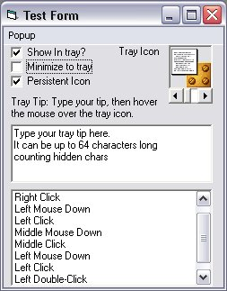

<div align="center">

## A Complete & Easy SysTray Dll


</div>

### Description

This dll and test project allow you to easily place an icon in the system tray and set its tooltip. This dll provides MouseMove, MouseDown, MouseUp, Click, DoubleClick, Minimize, and Restore events, and allows you to easily minimize a form to the tray. You can also specify a popup menu, and how it responds. (eg: on right click,double click etc...)

I've added a new property (Persistent) which reloads the icon if Explorer crashes. Please let me know if you find any bugs with it.
 
### More Info
 
icon, tooltip, form and several response style settings.

events are raised on all mouse activity, and the mouse button used is returned in the event

Will cause an error on shutdown if Class_Terminate code is not allowed to run (IE: using <B>End</B> to stop your program)


<span>             |<span>
---                |---
**Submitted On**   |2002-04-02 08:05:00
**By**             |[Alan Toews](https://github.com/Planet-Source-Code/PSCIndex/blob/master/ByAuthor/alan-toews.md)
**Level**          |Intermediate
**User Rating**    |4.6 (188 globes from 41 users)
**Compatibility**  |VB 5\.0, VB 6\.0
**Category**       |[Windows System Services](https://github.com/Planet-Source-Code/PSCIndex/blob/master/ByCategory/windows-system-services__1-35.md)
**World**          |[Visual Basic](https://github.com/Planet-Source-Code/PSCIndex/blob/master/ByWorld/visual-basic.md)
**Archive File**   |[A\_Complete67889422002\.zip](https://github.com/Planet-Source-Code/alan-toews-a-complete-easy-systray-dll__1-24089/archive/master.zip)

### API Declarations

```
'API declarations for setting the tray icon
Private Declare Function SetForegroundWindow _
Lib "user32" (ByVal hwnd As Long) As Long
Private Declare Function Shell_NotifyIcon _
Lib "shell32" Alias "Shell_NotifyIconA" _
(ByVal dwMessage As Long, pnid As NOTIFYICONDATA) As Boolean
'API declarations for capturing mouse events in
'the tray icon
Private Declare Function CallWindowProc _
Lib "user32" Alias "CallWindowProcA" (ByVal _
lpPrevWndFunc As Long, ByVal hwnd As Long, ByVal _
Msg As Long, ByVal wParam As Long, ByVal lParam _
As Long) As Long
Private Declare Function SetWindowLong _
Lib "user32" Alias "SetWindowLongA" (ByVal hwnd _
As Long, ByVal nIndex As Long, ByVal dwNewLong _
As Long) As Long
```


